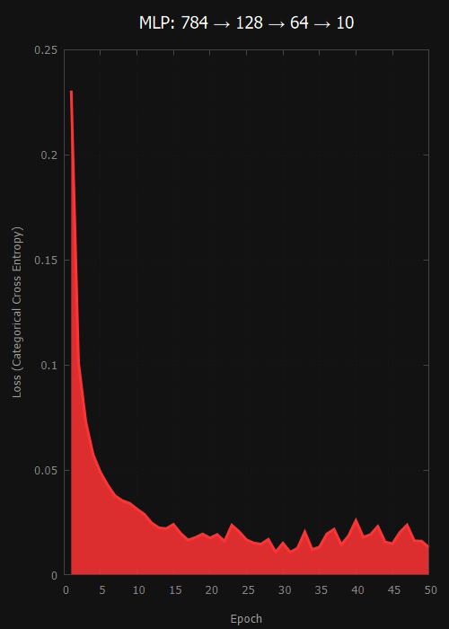

# MLP.h

**A tiny, single-header, dependency-free Multi-Layer Perceptron library for C.**  
  
Drop `MLP.h` into your project — no build system, no linking, no
external dependencies beyond the standard library.
  
**Version:** 0.8.1 · **License:** [MIT](LICENSE)

---



<div id="toc">
  <ul style="list-style: none">
    <summary>
      <h2>MNIST TEST</h2>
    </summary>
  </ul>
</div>

**Compile with:**
```bash
cd examples && gcc mnist.c -O3 -march=native
```

```text
./a
[########################################] 
100% Epoch    50/   50  Loss 1.317e-02

Training completed.

Epochs     : 50
Final Loss : 1.31719803e-02
Reason     : Maximum epochs reached

Score: 9771/10000
Accuracy: 97.71%
```

**Live Classifier:** [https://px7nn.github.io/MNIST/](https://px7nn.github.io/MNIST/)

---

<br clear="left"/>

## Features

- **Zero External Dependencies:** Pure, portable C99/C11. No linking required, with optional `<math.h>` support (`MLP_USE_LIBM`).
- **Flexible Network Configuration:** Configure arbitrary topologies, activation functions (`ReLU`, `Leaky ReLU`, `Sigmoid`, `Tanh`, `Softmax`, `Linear`), weight initializers (`He`, `Xavier`), and loss functions (`MSE`, `BCE`, `CCE`) via `NetworkConfig`.
- **Model Persistence:** Easily save and load trained networks to/from disk using compact binary files.
- **Built-in CSV Parsing:** Streamline dataset preparation with automated CSV loading (`MLP_LoadCSV`) or wrap existing memory arrays.
- **Structured Error Handling:** Features a robust global error reporting system with an opt-in fail-fast check (`MLP_EXIT_ON_ERROR`) to keep client code completely clean.

## Quick start

```c
#define MLP_IMPLEMENTATION   // in exactly one .c file
#include "MLP.h"
```

See [`docs/getting_started.md`](docs/getting_started.md) for a full
walkthrough.


## Documentation

- [Getting Started](docs/getting_started.md)
- [API Reference](docs/api.md)
- [Theory: how the forward pass, backprop, and training loop work](docs/theory.md)

See [`examples/`](examples/) for full training examples:
- [`xor_gate.c`](examples/xor_gate.c) — trains a network on XOR and saves it to `xor.mlp`.
- [`load_model.c`](examples/load_model.c) — loads `xor.mlp` and runs inference without retraining.
- [`load_csv.c`](examples/load_csv.c) — loads `circle.csv` via `MLP_LoadCSV`, trains, and predicts.
- [`mnist.c`](examples/mnist.c) — trains on handwritten digits using `Softmax` and `Categorical Cross Entropy` (compatible with the [Live MNIST Canvas Demo](https://px7nn.github.io/MNIST/)).
- [`visual_sin.c`](examples/visual_sin.c) — fits a sine wave and saves a visualization plot.


## Versioning

`MLP_VERSION_STRING` (and the matching `_MAJOR`/`_MINOR`/`_PATCH` macros)
are defined at the top of `MLP.h`. This project is pre-1.0, so the public
API may still change between minor versions.