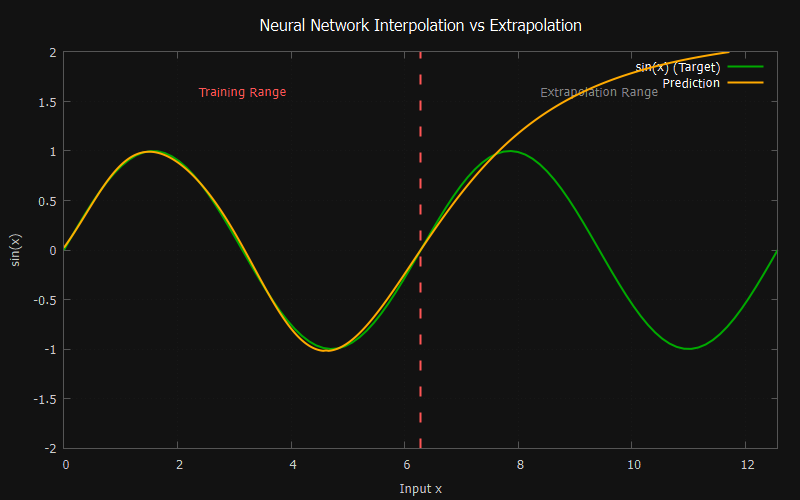

<div id="toc">
  <ul style="list-style: none">
    <summary>
      <h2>MLP.h</h2>
    </summary>
  </ul>
</div>

**A tiny, single-header, dependency-free Multi-Layer Perceptron library for C.**  
  
Drop `MLP.h` into your project — no build system, no linking, no
external dependencies beyond the standard library.
  
**Version:** 0.7.1 · **License:** [MIT](LICENSE)

---

<br clear="left"/>

## Features

- **Zero External Dependencies:** Pure, portable C99/C11. No linking required, with optional `<math.h>` support (`MLP_USE_LIBM`).
- **Flexible Network Configuration:** Configure arbitrary topologies, activation functions (`ReLU`, `Leaky ReLU`, `Sigmoid`, `Tanh`, `Linear`), weight initializers (`He`, `Xavier`), and loss functions (`MSE`, `BCE`) via `NetworkConfig`.
- **Model Persistence:** Easily save and load trained networks to/from disk using compact binary files.
- **Built-in CSV Parsing:** Streamline dataset preparation with automated CSV loading (`MLP_LoadCSV`) or wrap existing memory arrays.
- **Structured Error Handling:** Features a robust global error reporting system with an opt-in fail-fast check (`MLP_EXIT_ON_ERROR`) to keep client code completely clean.

## Quick start

```c
#define MLP_IMPLEMENTATION   // in exactly one .c file
#include "MLP.h"
```

See [`docs/getting_started.md`](docs/getting_started.md) for a full
walkthrough.


## Documentation

- [Getting Started](docs/getting_started.md)
- [API Reference](docs/api.md)
- [Theory: how the forward pass, backprop, and training loop work](docs/theory.md)

See [`examples/`](examples/) for a full training example
(`xor_gate.c`), a companion example that loads the saved model back
in for inference (`load_model.c`), and an example that trains directly
from a CSV file via `MLP_LoadCSV` (`load_csv.c`).


## Versioning

`MLP_VERSION_STRING` (and the matching `_MAJOR`/`_MINOR`/`_PATCH` macros)
are defined at the top of `MLP.h`. This project is pre-1.0, so the public
API may still change between minor versions.

## License

MIT — see [LICENSE](LICENSE).
